           
           
                   

New Relic Pathpoint is an enterprise platform tracker that models system health in relation to actual user-impacting the different business stages, and on this documentation you will learn the different concepts of a Pathpoint, as well as how to interact with the Pathpoint configuration, like for example how to tweak the different Pathpoints, to visually work with the data you are most interested in tracking.

 ### Index ###
 

 * [Pathpoint Concepts](#Pathpoint_Concepts)

     *   [Stages](#Stages) 

   *   [Steps](#Steps)

   *   [Touchpoints](#Touchpoints)

* [Pathpoint Configuration](#Pathpoint_Configuration)

   *  [JSON Configuration File](#JSON_Configuration_File)

     

      *[Setting up KPI queries](#Setting_up_KPI_queries)

      *[Setting up Stages & Steps](#Setting_up_Stages_Steps)

   

      * [Touchpoint Types](#Touchpoint_Types)  
         * [PCC (Process Count)](#PCC)  

         * [APP (Application Health)](#APP)

         * [FRT (Front End Health)](#FRT)

         * [SYN (Synthetic Check)](#SYN)

      *    [Setting up Touchpoints](#Setting_up_Touchpoints)

         	

    *  [In App Tuning](#In_App_Tuning) 

         *[Test a Touchpoint](#Test_a_Touchpoint)  

       *[Tune Touchpoint Thresholds](#Tune_Touchpoint_Thresholds)

       *[Disable a Touchpoint](#Disable_a_Touchpoint) 

   *  [Configure Logging](#Configure_Logging)

   *  [Configure Background Jobs](#Configure_Background_Jobs)

       * [Flame Filter Script](#Flame_Filter_Script)

      * [Drop Filter Script](#Drop_Filter_Script)

* [Using Special Filters](#Using_Special_Filters)

   *  [Canary Filter](#Canary_Filter)

   *  [Flame Filter](#Flame_Filter)

   *  [Drop Filter](#Drop_Filter)

### Pathpoint Concepts ###

Business Journey Observability, is the Customer, Product and Services Paths, including all Internal Processes & External Dependencies, needed to meet a customer’s expectation and or service agreement. Pathpoing is Business Journey Observability.

Pathpoint will work in nearly any New Relic account. And each Pathpoing is divided into; Stages, Steps and Pathpoints.

To get started setting up Pathpoint you'll need some telemetry in the account that you would like to measure. This could be -for instance- any of the following telemetry types: Metrics, Events, Logs and Traces. 

A common starting place for Pathpoint is APM Events and Logs, but this is up to you. The other thing you'll need to know is how this telemetry maps onto the business process you want to model as stages and steps. That may require some internal disucssions with your stakeholders to understand how things really fit in.

When you are ready to make some edits you can simply download the current version of the JSON config that was writen for you, edit it (if you wish to do so) and re-upload it. Alternatively you can also manually "right click" over the touchpoint you would like to work on, to adjust its configuration.

Return to top of [Index](#Index)

### Stages ###

The different stages of a Pathpoint, will allow you to see the business processes at a high level, and notice how for each commercial stage, different services and methods are presented at the system level. Based on business information, PathPoint previews latency indicators. 

And the information related to a particular stage, including the errors for each one of them, can be viewed on REAL TIME at a high level. 

On the following graphic, you can see that this particular Pathpoint has five stages in process.

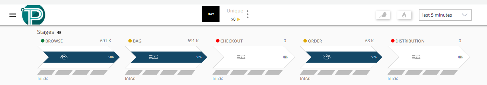

And on each particular stage we can see first-hand if any of its associated touchpoints are critical, and if this is the case, then the stage will turn yellow. If it stays green, it means that everything is working normally. And if instead the stage turns the color red, it means that all its touchpoints have anomalies, that need to be resolved.

### Steps ###

These are "sub-stages" of a main stage and represent a certain degree of granularity in your services.

- Structure Steps

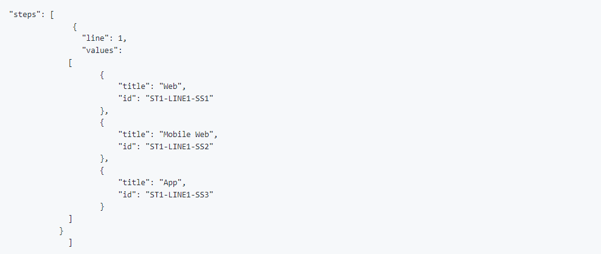

Where:

Line: Positions the row in which the task is located within the stage.

* Values: Indicate the parameters for each step. Currently the parameters "Web", "App", "Login"  and "Signup" are being considered
* Title: Corresponds to the name with which the step is identified.

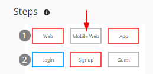

* ID: Corresponds to the code that identifies the step in its order within the row that is located. For the example, in line 1 the "Web" step is assigned the order # 1, the "Mobile Web" step has the order # 2 assigned and the "App" step is assigned the order # 3 in its configuration.

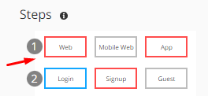

### Touchpoints ###

Touchpoints are the more granular entities of the PathPoint model. TouchPoints do behave more like a specific browser application or APM (Application Monitor). The health status of a TouchPoint will be linked to the error rate and latency.

The different types of touchpoints are; PRC, PCC, APC, FRT, and SYN.

* PRC are used to count people
* PCC are used to count processes
* APC are used to see the health of an application
* FRT FRONT END HEALTH?
* SYN are used for syntethic check what is this?

### Pathpoint Configuration ###

Pathpoint is configured using a JSON configuration file, which is writen to the needs of your particular business. Once the configuration file is loaded, you can also manually tweek the Touchpoints, for instance to see the data that you are most concern at the moment.

### JSON Configuration File ###

JSON for its acronym (JavaScript Object Notation) is a data structure, whose basic function is to allow for the exchange of information. Through this structure it will be possible to identify each of the elements and components that will facilitate the implementation of Pathpoint, knowing the function of its attributes, queries and data output. To program new stages, path and Pathpoints, you upload a New JSON Configuration file.

Uploading a New JSON Config File

Pathpoint offers the possibility to load the configuration file using the following steps;

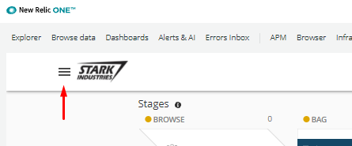

 1 To begin click on the menu at the top left

2 Select the option "JSON Configuration"

 
3 Now, select "Update"

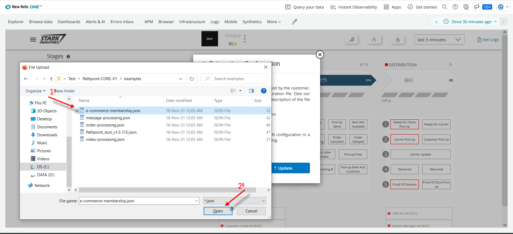

4 Next, locate the file you want to update and click on "open"

5 Finally the Pathpoint is displayed with the latest update loaded.

How to download the Currently Active Config File.

Similarly, Pathpoint offers you the possibility of downloading the current configuration file, if for instance you wish to make changes to it, which can be done using the following steps;

1 Click on the menu on the top left (once you are on the New Relic Pathpoint  window)

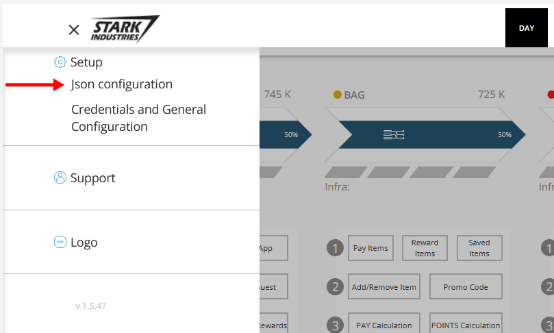

2 Select the option "JSON Configuration"

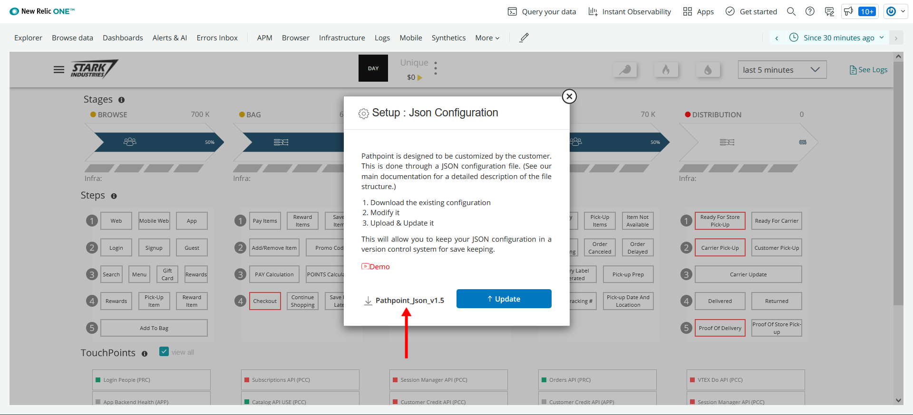

3 Now, select the file available to download. On this example"Pathpoint_json_vX"

4 Finally the file is downloaded so that you can work on it.

### Setting up KPI queries ###

KPI by its acronym (Key Performance Indicator), are normally known as key indicators, which allow you to see the performance of a process. 

In the case of Pathpoint, KPIs fulfill a fundamental function, which is the measurement of specific indicators within a particular process.

- Structure KPI

Where:

Type: Defines the type of measurement to be performed, which can be:
-- "100" returns the current measurement value.
-- "101" returns the current value and compares it with the value of "X" previous days

Name: Corresponds to the long name of the KPI.

ShortName: Corresponds to the short name of the KPI.

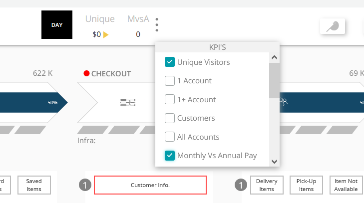

### Setting up Stages & Steps ###

* Measure: The data that allow the measurement to be made is displayed.

* accountID: Corresponds to the number that identifies the measurement performed.

* Query: Corresponds to the query that is used to perform the measurement.

* Link: Corresponds to the link that directs to the KPI dashboard.

* Value_type: It can be an integer value "INT" (example: 100) or a decimal value "FLOAT" (example: 100,2).

* Prefix: It is used in the case in which you want to Identify the KPI by placing a symbol or letter at the beginning of the name. Example: USD 12000

* Suffix: It is used in the case where you want to Identify the KPI by adding a symbol or letter at the end of the name. Example: 5%.

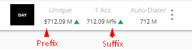

* Example KPI

* KPI Pathpoint Image

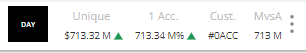

Return to top of [Index](#Index)

### Touchpoint Types ### 

Pathpoint offers different types of touchpoints, which are adapted according to the needs of each business, and they are; PRC (Person Count),PCC (Process Count), APP (Application Health), FRT (Front End Health), and SYN (Synthetic Check)

Now, you will see some examples of each type of touchpoint;

This is an example of a PCC touchpoint;

PCC (Process Count)

● Data:  
   ○ Transactions

● Tunning:  
   ○ Transactions Count (Min)

● Link: PCC Touchpoint Flashboard  
○ Current Transactions  
○ Past Transactions  
○ Previous Week Comparison

This is an example of a APP touchpoint;

APP (Application Health)  
● Data:  
○ Transactions

● Tunning:  
○ APDEX Response (Min)  
○ % Error (Max)  
○ Response Time (Max) 

● Link: APM Transaction Dashboard  
○ APDEX  
○ Throughput  
○ Breakdown  
○ Traces

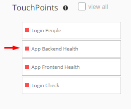

This is an example of a FRT touchpoint;

FRT (Front End Health)  
● Data:  
○ Transactions

● Tunning:  
○ APDEX Response (Min)  
○ % Error (Max)  
○ Response Time (Max)  

● Link: Page View Transaction Dashboard  
○ APDEX  
○ Throughput  
○ Breakdown  
○ Traces

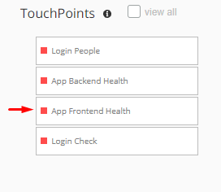

This is an example of a SYN touchpoint;

SYN (Synthetic Check)  
● Data:  
○ Synthetic Monitor Data

● Tunning:  
○ Avg Request Time (Max)  
○ Total Check Time (Max)  
○ % Success Rate (Min)  

● Link: Synthetic Monitor Results Dashboard  
○ Long Running Tasks  
○ Bytes Transferred  
○ Requests  
○ Total Time  
○ Requests Waterfall  

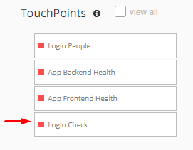

### Setting up Touchpoints ###

Return to top of [Index](#Index)
### In App Tuning ###

Return to top of [Index](#Index)
### Test a Touchpoint ###

Return to top of [Index](#Index)
### Tune Touchpoint Thresholds ###

Return to top of [Index](#Index)
### Disable a Touchpoint ###

You can manually work with a particular Touchpoint, by disabling it, and later on you can also turn it back on.

To disable a Touchpoint, right click on it. On this example I clicked on the Customer credit API (which is a PCC type of Touchpoint).

Return to top of [Index](#Index)
### Configure Logging###

Return to top of [Index](#Index)
### Configure Background Jobs ###

Return to top of [Index](#Index)
### Flame Filter Script ###

Return to top of [Index](#Index)
### Drop Filter Script ###

Return to top of [Index](#Index)
### Using Special Filters ###

Return to top of [Index](#Index)
### Canary Filter ###

The Canary filter, when activated, reset all the the different Steps, so that you can manually activate the Steps, which will help you troubleshoot a particular process.

To activate it, just click on the Canary Symbol, which now changes it color, to yellowish. On the Pop Up window that opens up, click on "Continue" to activate this filter.

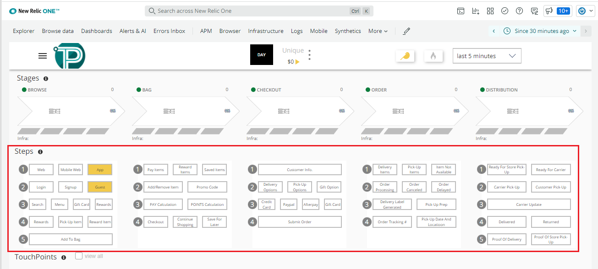

Now you see that the steps that were previously active, don't show any activity. Please notice that if you are running the Pathpoint background job the signals for non-visible touchpoints will still be available with the Flame view.

Return to top of [Index](#Index)
### Flame Filter ###

The Flame filter will highlight the most problematic “Steps and Touchpoints” with a configurable time window and percentile threshold. The filter will show the worst and percentile of touchpoints. 

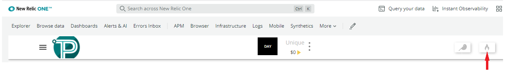

To activate it, just click on the Flame Symbol, which now changes it color, to a reddish flame. On the Pop Up window that opens up, click on "Continue" to activate this filter.

This is very useful in situations where things look okay now but may have had a pattern of errors or latency in the recent past. Please not that to use this filter, you will need to install a background script that is downloadable from the Pathpoint Setup Menu.

Return to top of [Index](#Index)

### Drop Filter ###

Function: 

 
Highlights Steps with Most Drops (Session Breaks or Abandonment) 

Displays a Total Drop count per Stage
Calculates the order or transaction loss by the drops

Tunning: 
Avg Order or Transaction Value
Incident %
Time Period

Return to top of [Index](#Index)