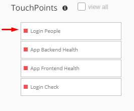
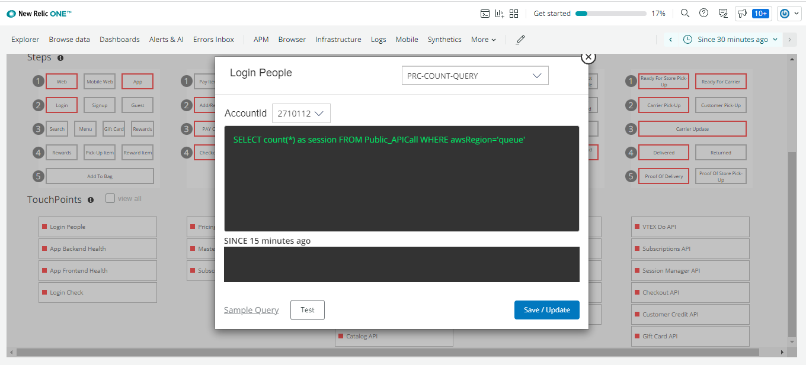
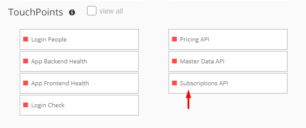
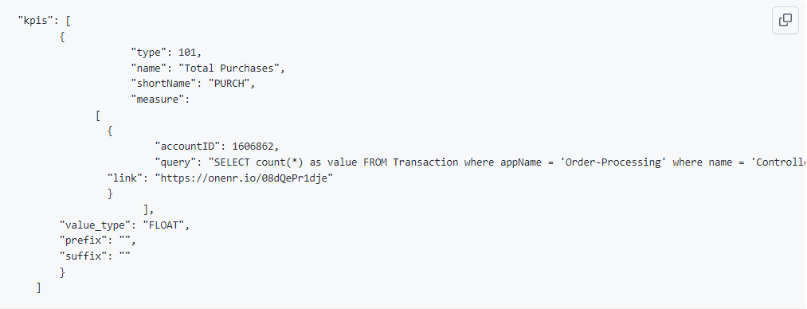
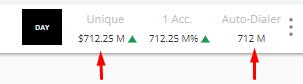

           
           
                   New Relic Pathpoint Documentation

Pathpoint is an enterprise platform tracker that models system health in relation to actual user-impacting business stages, and on this documentation you will learn how to interact with the Pathpoint GUI, like for example how to tweak the different Pathpoints, to get the data you are interested in tracking.

 ### Index ###
 

 * [Pathpoint Concepts](#Pathpoint_Concepts)

     *   [Stages](#Stages) 

   *   [Steps](#Steps)

   *   [Touchpoints](#Touchpoints)

* [Pathpoint Configuration](#Pathpoint_Configuration)

   *  [JSON Configuration File](#JSON_Configuration_File)

     

      *[Setting up KPI queries](#Setting_up_KPI_queries)

      *[Setting up Stages & Steps](#Setting_up_Stages_Steps)

      *[Setting up Touchpoints](#Setting_up_Touchpoints)

      * [Touchpoint Types](#Touchpoint_Types)  
         * [PCC (Process Count)](#PCC)  

         * [APP (Application Health)](#APP)

         * [FRT (Front End Health)](#FRT)

         * [SYN (Synthetic Check)](#SYN)

    *  [In App Tuning](#In_App_Tuning) 

         *[Test a Touchpoint](#Test_a_Touchpoint)  

       *[Tune Touchpoint Thresholds](#Tune_Touchpoint_Thresholds)

       *[Disable a Touchpoint](#Disable_a_Touchpoint) 

   *  [Configure Logging](#Configure_Logging)

   *  [Configure Background Jobs](#Configure_Background_Jobs)

       * [Flame Filter Script](#Flame_Filter_Script)

      * [Drop Filter Script](#Drop_Filter_Script)

* [Using Special Filters](#Using_Special_Filters)

   *  [Canary Filter](#Canary_Filter)

   *  [Flame Filter](#Flame_Filter)

   *  [Drop Filter](#Drop_Filter)

### Pathpoint Concepts ###

Pathpoint will work in nearly any New Relic account. To get started setting up Pathpoint you'll need some telemetry in the account that you would like to measure. 

This could be -for instance- any of the following telemetry types: Metrics, Events, Logs and Traces. 

A common starting place for Pathpoint is APM Events and Logs, but it is up to you. The other thing you'll need to know is how this telemetry maps onto the business process you want to model as stages and steps. That may require some internal disucssions with your stakeholders to understand how things really fit in.

When you are ready to make some edits you can simply download the current version of the JSON config, edit and re-upload it. You can also use "right click" to adjust touchpoint configurations.

Return to top of [Index](#Index)

### Stages ###

The stages of a Pathpoint, allow you to see the business processes at a high level, and for each commercial stage, different services and methods are presented at the system level. Based on business information, PathPoint previews latency indicators. 

And the information related to a particular stage, including the errors for each one of them, can be viewed on REAL TIME at a high level. In each particular stage we can see first-hand if any of its associated touchpoints are critical, and if this is the case, then the stage will turn yellow. If it stays green, it means that everything is working normally. And if instead the stage turns the color red, it means that all its touchpoints have anomalies, that need to be resolved.

### Steps ###

These are "sub-stages" of a main stage and represent a certain degree of granularity in your services.

- Structure Steps

Where:

Line: Positions the row in which the task is located within the stage.

* Values: Indicate the parameters for each step. Currently the parameters "title" and "ID" are considered
* Title: Corresponds to the name with which the step is identified.

* ID: Corresponds to the code that identifies the step in its order within the row that is located. For the example, in line 1 the "Web" step is assigned the order # 1, the "Mobile Web" step has the order # 2 assigned and the "App" step is assigned the order # 3 in its configuration.

### Touchpoints ###

Touchpoints are the more granular entities of the PathPoint model. TouchPoints do behave more like a specific browser application or APM (Application Monitor). The health status of a TouchPoint will be linked to the error rate and latency.

PCC (Process Count)
● Data:
○ Transactions

● Tunning:
○ Transactions Count (Min)

● Link: PCC Touchpoint Flashboard
○ Current Transactions
○ Past Transactions
○ Previous Week Comparison

APP (Application Health)
● Data:
○ Transactions

● Tunning:
○ APDEX Response (Min)
○ % Error (Max)
○ Response Time (Max)

● Link: APM Transaction Dashboard
○ APDEX
○ Throughput
○ Breakdown
○ Traces

FRT (Front End Health)
● Data:
○ Transactions

● Tunning:
○ APDEX Response (Min)
○ % Error (Max)
○ Response Time (Max)

● Link: Page View Transaction Dashboard
○ APDEX
○ Throughput
○ Breakdown
○ Traces

SYN (Synthetic Check)
● Data:
○ Synthetic Monitor Data

● Tunning:
○ Avg Request Time (Max)
○ Total Check Time (Max)
○ % Success Rate (Min)

● Link: Synthetic Monitor Results Dashboard
○ Long Running Tasks
○ Bytes Transferred
○ Requests
○ Total Time
○ Requests Waterfall

### Pathpoint Configuration ###

### JSON Configuration File ###

JSON for its acronym (JavaScript Object Notation) is a data structure, whose basic function is to allow for the exchange of information. Through this structure it will be possible to identify each of the elements and components that will facilitate the implementation of Pathpoint, knowing the function of its attributes, queries and data output.

### Setting up KPI queries ###

KPI by its acronym (Key Performance Indicator), are normally known as key indicators, which allow you to see the performance of a process. 

In the case of Pathpoint, KPIs fulfill a fundamental function, which is the measurement of specific indicators within a particular process.

- Structure KPI

Where:

Type: Defines the type of measurement to be performed, which can be:
-- "100" returns the current measurement value.
-- "101" returns the current value and compares it with the value of "X" previous days

Name: Corresponds to the long name of the KPI.

ShortName: Corresponds to the short name of the KPI.

### Setting up Stages & Steps ###

* Measure: The data that allow the measurement to be made is displayed.

* accountID: Corresponds to the number that identifies the measurement performed.

* Query: Corresponds to the query that is used to perform the measurement.

* Link: Corresponds to the link that directs to the KPI dashboard.

* Value_type: It can be an integer value "INT" (example: 100) or a decimal value "FLOAT" (example: 100,2).

* Prefix: It is used in the case in which you want to Identify the KPI by placing a symbol or letter at the beginning of the name. Example: USD 12000

* Suffix: It is used in the case where you want to Identify the KPI by adding a symbol or letter at the end of the name. Example: 5%.

* Example KPI

* KPI Pathpoint Image

Return to top of [Index](#Index)
### Setting up Touchpoints ###

Return to top of [Index](#Index)
### Touchpoint_Types ###

Pathpoint offers different types of touchpoints, which are adapted according to the needs of the business. Below is the description and a brief example for each case:

PRC (Person Count)
● Data:
○ User Sessions

● Tunning:
○ Session Count (Min)

● Link: PRC Touchpoint Flashboards
○ Current Sessions
○ Past Sessions
○ Previous Week Comparison

### PCC (Process Count) ###

Return to top of [Index](#Index)

### APP (Application Health) ###

Return to top of [Index](#Index)
### FRT (Front End Health) ###

Return to top of [Index](#Index)
### SYN (Synthetic Check) ###

Return to top of [Index](#Index)
### In App Tuning ###

Return to top of [Index](#Index)
### Test a Touchpoint ###

Return to top of [Index](#Index)
### Tune Touchpoint Thresholds ###

Return to top of [Index](#Index)
### Disable a Touchpoint ###

Return to top of [Index](#Index)
### Configure Logging###

Return to top of [Index](#Index)
### Configure Background Jobs ###

Return to top of [Index](#Index)
### Flame Filter Script ###

Return to top of [Index](#Index)
### Drop Filter Script ###

Return to top of [Index](#Index)
### Using Special Filters ###

Return to top of [Index](#Index)
### Canary Filter ###

Return to top of [Index](#Index)
### Flame Filter ###

Return to top of [Index](#Index)
### Drop Filter ###

