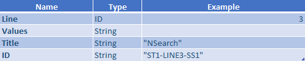

To setup the steps of a Pathpoint.

- Structure Steps
"steps": [
              {
                "line": 1,
                "values": 
	     [
                    {
                        "title": "Web",
                        "id": "ST1-LINE1-SS1"
                    },
                    {
                        "title": "Mobile Web",
                        "id": "ST1-LINE1-SS2"
                    },
                    {
                        "title": "App",
                        "id": "ST1-LINE1-SS3"
                    }
	     ]
	   }
             ]

Where:

Line: 

Positions the row in which the task is located within the stage.

* Values: Indicate the parameters for each step. Currently the parameters "title" and "ID" are considered
* Title: Corresponds to the name with which the step is identified.

ID: Corresponds to the code that identifies the step in its order within the row that is located. For the example, in line 1 the "Web" step is assigned the order # 1, the "Mobile Web" step has the order # 2 assigned and the "App" step is assigned the order # 3 in its configuration.

- Examples Steps

Example 2

- Steps Images  

When you click on any of the steps, even more detailed services and functions will be displayed in the list of associated TouchPoints. When a stage has a red border, it means that there is an error type anomaly for that stage.

A step contains one or more contact points. Each step allows business stakeholders to understand the performance of the system in some way without going into all the implementation details.

[Return to main Index](readme1.md) 