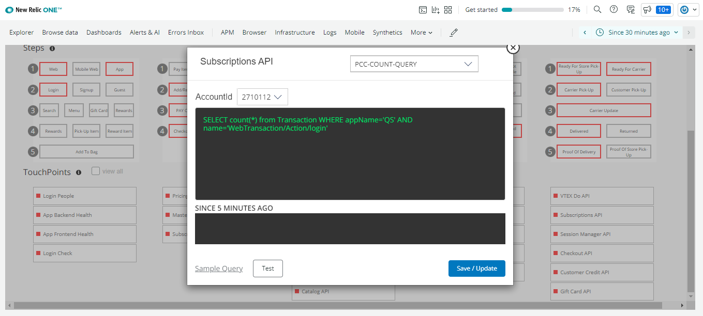

Touchpoints are the more granular entities of the PathPoint model. TouchPoints do behave more like a specific browser application or APM (Application Monitor). The health status of a TouchPoint will be linked to the error rate and latency.

PCC (Process Count)
● Data:
○ Transactions

● Tunning:
○ Transactions Count (Min)

● Link: PCC Touchpoint Flashboard
○ Current Transactions
○ Past Transactions
○ Previous Week Comparison

APP (Application Health)
● Data:
○ Transactions

● Tunning:
○ APDEX Response (Min)
○ % Error (Max)
○ Response Time (Max)

● Link: APM Transaction Dashboard
○ APDEX
○ Throughput
○ Breakdown
○ Traces

FRT (Front End Health)
● Data:
○ Transactions

● Tunning:
○ APDEX Response (Min)
○ % Error (Max)
○ Response Time (Max)

● Link: Page View Transaction Dashboard
○ APDEX
○ Throughput
○ Breakdown
○ Traces

SYN (Synthetic Check)
● Data:
○ Synthetic Monitor Data

● Tunning:
○ Avg Request Time (Max)
○ Total Check Time (Max)
○ % Success Rate (Min)

● Link: Synthetic Monitor Results Dashboard
○ Long Running Tasks
○ Bytes Transferred
○ Requests
○ Total Time
○ Requests Waterfall

[Return to main Index](https://github.com/Alcones1/nr1-pathpoint/blob/main/Readme1.md) 