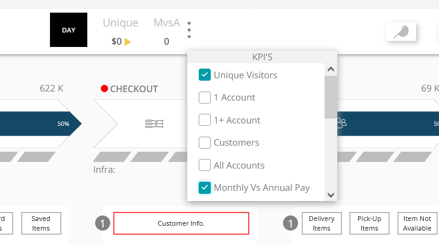
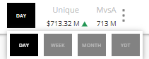

#### KPI

KPI by its acronym (Key Performance Indicator), are normally known as key indicators, which allow knowing the performance of a process. In the case of Pathpoint, KPIs fulfill a fundamental function, which is the measurement of specific indicators within a particular process. 

#### - Structure KPI

   
     "kpis": [
        	{
             	    "type": 101,
            	    "name": "Total Purchases",
            	    "shortName": "PURCH",
            	    "measure": 
		      [
                	{
                    	"accountID": 1606862,
                    	"query": "SELECT count(*) as value FROM Transaction where appName = 'Order-Processing' where name = 'Controller/Sinatra//purchase' and http.statusCode = 200 COMPARE WITH 1 week ago",
                    "link": "https://onenr.io/08dQePr1dje"
                	}
            	      ],
            "value_type": "FLOAT",
            "prefix": "",
            "suffix": ""
        	}
	    ]

Where:

 - ***Type***: *Defines the type of measurement to be performed, which can be:  
 -- "100" returns the current measurement value.  
 -- "101" returns the current value and compares it with the value of "X" previous days*
 - ***Name***: *Corresponds to the long name of the KPI.*
 - ***ShortName***: *Corresponds to the short name of the KPI.*  
    
 - ***Measure***: *The data that allow the measurement to be made is displayed*.
 - ***accountID***: *Corresponds to the number that identifies the measurement performed*. 
 - ***Query***: *Corresponds to the query that is used to perform the measurement*. 
 - ***Link***: *Corresponds to the link that directs to the KPI dashboard.*  
    
 
 - ***Value_type***: *It can be an integer value "INT" (example: 100) or a decimal value "FLOAT" (example: 100,2)*.  
    
 - ***Prefix***: *It is used in the case in which you want to Identify the KPI by placing a symbol or letter at the beginning of the name. Example: USD 12000*
 - ***Suffix***: *It is used in the case where you want to Identify the KPI by adding a symbol or letter at the end of the name. Example: 5%*.
   
    

#### - Example KPI 
  

#### - KPI Pathpoint Image

 

 

[Return to Readme file Index](readme.md) 