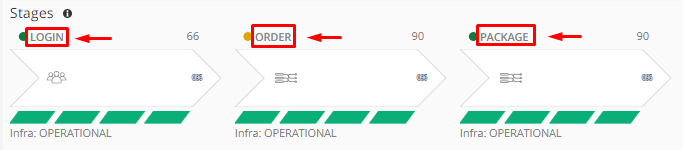
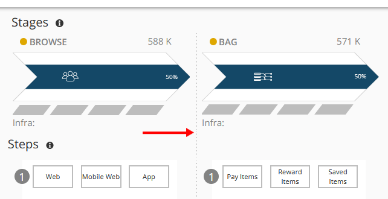
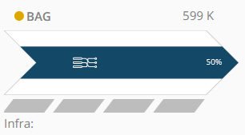
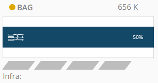
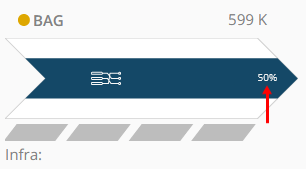
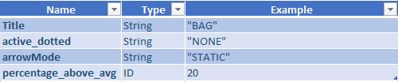

### Stages of a Pathpoint
Here you can see the business stages at a high level. For each commercial stage, different services and methods are presented at the system level. Based on business information, PathPoint previews latency indicators.
All the information related to the stage, including the errors for each one of them, allows to detail certain aspects at a high level. In a stage we can see first-hand if any of its associated touchpoints is critical, and if this happens, then the stage will turn yellow. If it stays green, it means that everything is working normally. And if the stage turns red, it means that all its touchpoints have anomalies.

#### - Structure Stage

	"stages": 
	[
           {
            "title": "BROWSE",
            "active_dotted": "none",
            "arrowMode": "FLOW",
            "percentage_above_avg": 20,
	    	"steps": 
		 [
		  "Code steps..."
		 ]
		    "touchpoints": 
			[
			   "Code touchpoints..."
			]
	   }
	 ]
	  
	  
Where:
 - ***Title ***: *Corresponds to the name that identifies the stage*  
   
 - ***Active_dotted***: *Defines the display of the start or end of a flow. It only handles three values: "none", "dotted" or "dashed". By default it takes the value "none". When the value is changed to "dotted", it adds some dotted lines to the left of the stage where it is defined. When the value is changed to "dashed", it adds some dashed lines to the left of the stage where it is defined.*  
 Here is an example when activating "dotted"  
  
 - ***ArrowMode***: *Defines the shape of the arrow on the header of the Stages. It only handles two values: "FLOW" and "STATIC". By default it is "FLOW"*  
 Example with "FLOW" 
  
 Example with "static"  
  
 - ***Percentage_above_avg***: *Indicates the percentage that is above the mean*  
  

#### - Examples stage  
Example 1 

  
Example 2 
  

[Return to Readme file Index](readme.md) 