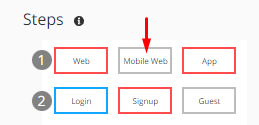

### Steps of a Pathpoint
These are "sub-stages" of a main stage and represent a certain degree of granularity in your services. 

#### - Structure Steps

	"steps": [
                  {
                    "line": 1,
                    "values": 
		     [
                        {
                            "title": "Web",
                            "id": "ST1-LINE1-SS1"
                        },
                        {
                            "title": "Mobile Web",
                            "id": "ST1-LINE1-SS2"
                        },
                        {
                            "title": "App",
                            "id": "ST1-LINE1-SS3"
                        }
		     ]
		   }
                 ]

Where:
- ***Line***: *Positions the row in which the task is located within the stage.*  
  
- ***Values***: *Indicate the parameters for each step. Currently the parameters "title" and "ID" are considered*
- ***Title***: *Corresponds to the name with which the step is identified.*  
  
- ***ID***: *Corresponds to the code that identifies the step in its order within the row that is located. For the example, in line 1 the "Web" step is assigned the order # 1, the "Mobile Web" step has the order # 2 assigned and the "App" step is assigned the order # 3 in its configuration.*  
  

#### - Examples Steps  
Example 1 

  
Example 2 
  

#### - Steps Images
When you click on any of the steps, even more detailed services and functions will be displayed in the list of associated TouchPoints. When a stage has a red border, it means that there is an error type anomaly for that stage.  

A step contains one or more contact points. Each step allows business stakeholders to understand the performance of the system in some way without going into all the implementation details.   

[Return to Readme file Index](readme.md)