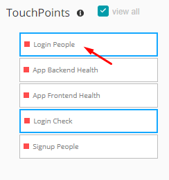
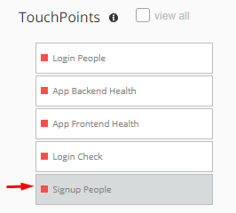
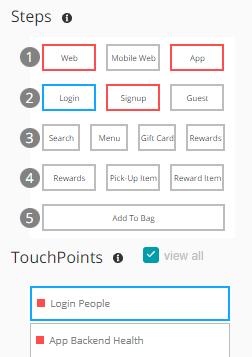
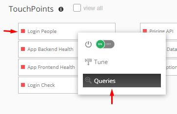
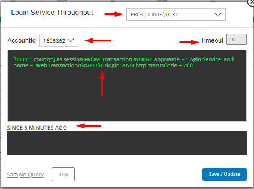
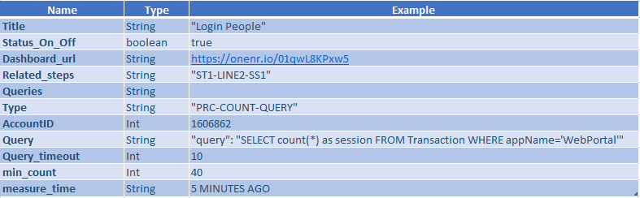
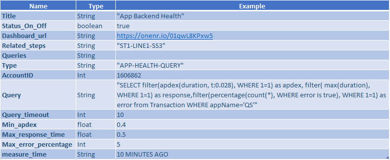
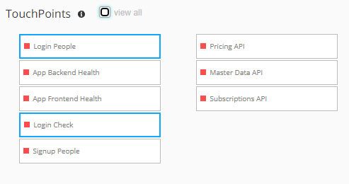
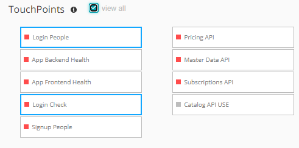
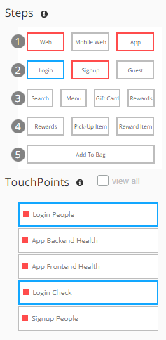

#### Touchpoints
These detail the more granular entities of the PathPoint model. TouchPoints behave like a specific browser application or APM (Application Monitor). The health status of a TouchPoint will be linked to the error rate and latency.  

#### - Structure Touchpoint

	"touchpoints": 
	[
                {
                    "title": "Login People",
                    "status_on_off": true,
                    "dashboard_url": 
		    [
                        "https://onenr.io/01qwL8KPxw5"
                    ],
                    "related_steps": "ST1-LINE2-SS1",
                    "queries": 
		    [
                        {
                            "type": "PRC-COUNT-QUERY",
                            "accountID": 1606862,
                            "query": "SELECT count(*) as session FROM Transaction WHERE appName='WebPortal'",
			    "query_timeout": 10,
                            "min_count": 100,
			    "measure_time": "5 MINUTES AGO"
                        }
                    ]
                }
          ]

Where:
- ***Title***: *Corresponds to the name that identifies the touchpoint.*  
  
- ***Status_on_off***: *This option allows you to enable or disable a touchpoint for display mode. To access this view, you just have to right click on the touchpoint and select the option "on/off"*  
  
  
- ***Dashboard_url***: *Corresponds to the link that directs to the tochpoint dashboard.*  
- ***Related_steps***: *Indicates the step to which it is associated. For the example, the "Login People" touchpoint is linked to the "Login" step.*  
  
- ***Queries***: *Here you can determine all the query parameters that alert the touchpoint. To access this view, you just have to right click on the touchpoint and select the option "queries"*  
- ***Type***: *Identify the type of query. For the example, it is a session count, hence the abbreviation PRC-People Count (Vew section "Different Touchpoint Types Explained")*  
- ***AccountID***: *Determines the code with which the query is identified.*  
- ***Query***: *Displays the query that actually determines the tocuhpoint.*  
- ***Query_timeout***: *Determines the maximum time of activity in which the query will be executing.*  
- ***Min_count***: *The query will present a minimum of 100 records.*  
- ***Measure_time***: *Determines from when I want the query to collect information to perform the measurement. Example, 5 minutes ago*  
  
   

#### - Examples Touchpoint  
Example 1 

  
Example 2 
  

#### - Touchpoint Images
In this section you can view all the configured touchpoints, or if you wish you can see only the ones that present problems (to do this, just deactivate the "view all" box).   
 
  
When you select a step, Pathpoint will highlight the touchpoints related to that step. If the touchpoints are healthy, the step will be outlined in blue. If any of the touchpoints show anomalies, the step will be marked in red outline.   
  

[Return to Readme file Index](readme.md)