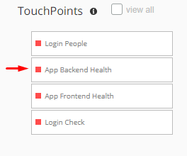
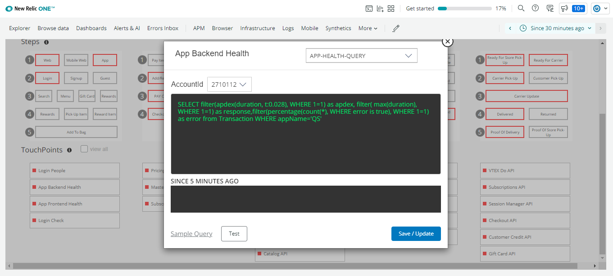
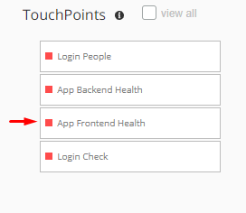

### Different Touchpoint Types Explained
Pathpoint offers different types of touchpoints, which are adapted according to the needs of the business. Below is the description and a brief example for each case:

#### PRC (Person Count) 
●	Data:  
○	User Sessions  

●	Tunning:  
○	Session Count (Min)

●	Link: PRC Touchpoint Flashboards  
○	Current Sessions  
○	Past Sessions  
○	Previous Week Comparison  

   
  
#### PCC (Process Count) 
●	Data:  
○	Transactions  

●	Tunning:  
○	Transactions Count (Min)

●	Link: PCC Touchpoint Flashboard   
○	Current Transactions  
○	Past Transactions  
○	Previous Week Comparison 

   
  
#### APP (Application Health) 
●	Data:   
○	Transactions

●	Tunning:  
○	APDEX Response (Min)  
○	% Error (Max)  
○	Response Time (Max)  

●	Link: APM Transaction Dashboard  
○	APDEX  
○	Throughput  
○	Breakdown  
○	Traces   

   
  
#### FRT (Front End Health) 
●	Data:   
○	Transactions

●	Tunning:  
○	APDEX Response (Min)  
○	% Error (Max)  
○	Response Time (Max)

●	Link: Page View Transaction Dashboard  
○	APDEX  
○	Throughput   
○	Breakdown  
○	Traces  

   
  
#### SYN (Synthetic Check)  
●	Data:  
○	Synthetic Monitor Data

●	Tunning:  
○	Avg Request Time (Max)  
○	Total Check Time (Max)  
○	% Success Rate (Min) 

●	Link: Synthetic Monitor Results Dashboard  
○	Long Running Tasks  
○	Bytes Transferred  
○	Requests  
○	Total Time  
○	Requests Waterfall  

   
  

[Return to Readme file Index](readme.md)

