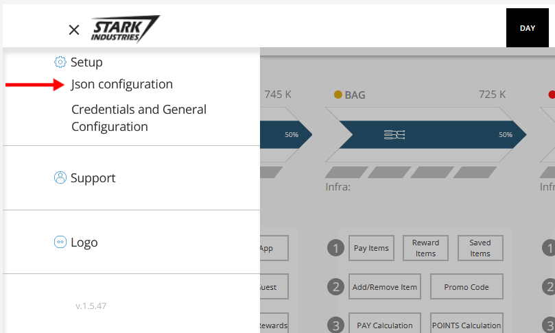
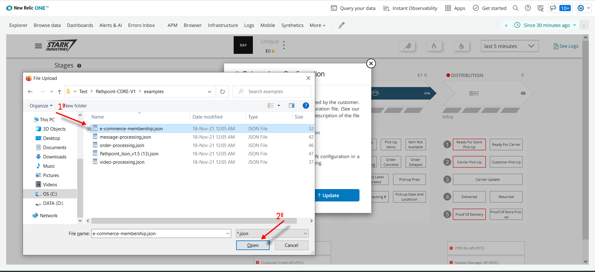
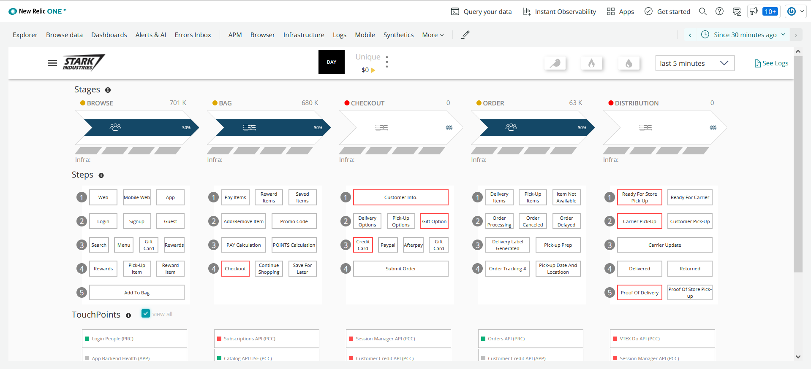
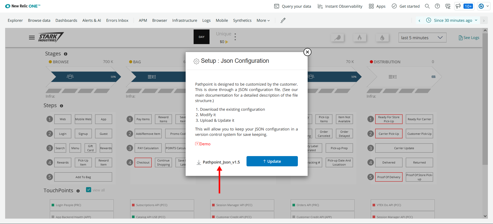

The configuration of pathpoint is managed by a powerful JSON configuration file that let's you add and configure stages, steps, and touchpoints. The file can be uploaded and downloaded directly from the Pathpoint UI.

Uploading a New Config File

Pathpoint offers the possibility to load the configuration file through the following option.

1. Go to the menu at the top left  
  
2. Enter the option "JSON Configuration"  
  
3. Then select "Update"  
  
4. Locate the file you want to update and click on "open"  
  
5. Finally the pathopint is displayed with the latest update loaded.  

   

### Downloading the Currently Active Config File

Similarly, Pathpoint offers the possibility of downloading the configuration file through the following option.

1. Go to the menu at the top left  
  
2. Enter the option "JSON Configuration"  
  
3. Then select the option available to download "Pathpoint_json_vX"  
  
4. Host the file in the location you want  
  
5. Finally the file is downloaded for your consultation  
  

[Return to Readme file Index](readme.md)  
