           
           
                   

New Relic Pathpoint is an enterprise platform tracker that models system health in relation to actual user-impacting the different business stages, and on this documentation you will learn the different concepts of a Pathpoint,  as well as how to interact with the Pathpoint configuration, like for example how to tweak the different Touchpoints of a Pathpoint, to better visualize the data you are most interested in tracking.

 ### Index ###
 

 * [Pathpoint Concepts](#Pathpoint_Concepts)

     *   [Stages](#Stages) 

   *   [Steps](#Steps)

   *   [Touchpoints](#Touchpoints)

* [Pathpoint Configuration](#Pathpoint_Configuration)

   *  [JSON Configuration File](#JSON_Configuration_File)

     

      *[Setting up KPI queries](#Setting_up_KPI_queries)

      *[Setting up Stages & Steps](#Setting_up_Stages_Steps)

   

      * [Touchpoint Types](#Touchpoint_Types)     

         *  [PRC (Used to count people)](#PRC)  

         * [PCC (Process Count)](#PCC)  

         * [APP (Application Health)](#APP)

         * [FRT (Front End Health)](#FRT)

         * [SYN (Synthetic Check)](#SYN)

      *    [Setting up Touchpoints](#Setting_up_Touchpoints)

         	

    *  [App Touchpoint Tuning](#In_App_Tuning) 

         *[Test a Touchpoint](#Test_a_Touchpoint)  

       *[Tune Touchpoint Thresholds](#Tune_Touchpoint_Thresholds)

       *[Disable a Touchpoint](#Disable_a_Touchpoint) 

   *  [Configure Logging](#Configure_Logging)

   *  [Configure Background Jobs](#Configure_Background_Jobs)

       * [Flame Filter Script](#Flame_Filter_Script)

      * [Drop Filter Script](#Drop_Filter_Script)

* [Using Special Filters](#Using_Special_Filters)

   *  [Canary Filter](#Canary_Filter)

   *  [Flame Filter](#Flame_Filter)

   *  [Drop Filter](#Drop_Filter)

### Pathpoint Concepts ###

Business Journey Observability, is the Customer, Product and Services Paths, including all Internal Processes & External Dependencies, needed to meet a customer’s expectation and or service agreement. Pathpoing is Business Journey Observability.

Pathpoint will work in nearly any New Relic account. And each Pathpoint is divided into; Stages, Steps and Touchpoints.

To get started setting up Pathpoint you'll need some telemetry in the account that you would like to measure. This could be -for instance- any of the following telemetry types: Metrics, Events, Logs and Traces. 

A common starting place for Pathpoint is APM Events and Logs, but this is up to you. The other thing you'll need to know is how this telemetry maps onto the business process you want to model as stages and steps. That may require some internal discussions with your stakeholders to understand how things really fit in.

To configure your Pathpoint simply download the current version of the JSON config that was writen for you, or edit it yourself (if you wish to do so) and then re-upload it. Alternatively you can also manually "right click" over each one of the touchpoints you would like to work on, to manually adjust its configuration.

Return to top of [Index](#Index)

### Stages ###

Stages are the principal parts of the Journey. They are defined as either a Person or a Process Stage and are design to show the complete health, congestion, count and Infrastructure state of a Pathpoint. 

The different Stages of a Pathpoint (five for now), will allow you to see the business processes at a high level, and notice how for each commercial stage, different services and methods are presented at the system level. Based on business information, PathPoint previews latency indicators. 

And the information related to a particular stage, including the errors for each one of them, can be viewed on REAL TIME at a high level. And on each particular stage we can see first-hand if any of its associated touchpoints are critical, and if this is the case, then the stage will turn yellow. If it stays green, it means that everything is working normally. And if instead the stage turns the color red, it means that all its touchpoints have anomalies, that need to be resolved. 

On the following graphic, you can see that this particular Pathpoint has five stages in process.

Additionally if the Stage turns blue, like on the example above, this represents congestiong on the Stage, and if the color of the stage is white, it means is free of congestion.

Please note that under a single Stage you should only count either persons (PRC Touchpoint) or processes (PCC Touchpoint). On the graphic above you can see the symbols for the two types of Stages;  

    A Processes  
    B People

### Steps ###

Steps represent the various actions/events occurring throughout the stage. They can be placed in the traditional sequential manner of step 1,2,3.., But also in a parallel form to represent optional and simultaneous actions and activities. 

These are "sub-stages" of a main stage and represent a certain degree of granularity in your services.

- Structure Steps

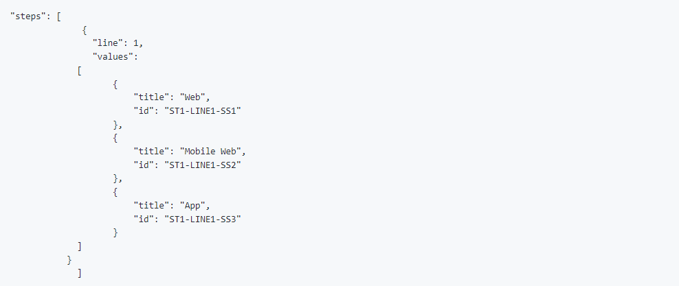

Where:

Line: Positions the row in which the task is located within the stage.

* Values: Indicate the parameters for each step. Currently the parameters 1) "Web", "App","Login"  and "Signup" are being considered. 3) Search, Menu, Gift Card, and Rewards aren't being considered.

* Title: Corresponds to the name with which the Step is identified. On this example; "Customer info."

* ID: Corresponds to the code that identifies the step in its order within the row that is located. For the example, in line 1 the "Web" step is assigned the order # 1, the "Mobile Web" step has the order # 2 assigned and the "App" step is assigned the order # 3 in its configuration.

### Touchpoints ###

Touchpoints are the more granular entities of the PathPoint model. TouchPoints do behave more like a specific browser application or APM (Application Monitor). 

Touchpoints do also hold individual Health, Status, Performance, Count and even Business knowledge of a specific data object, environment, app, device, API or service. Additionally every Touchpoint can be tuned and modified to fit a specific journey’s goal.

And every Step of a Pathpoint is connected to one or more Touchpoints and Every Stage Status is based on the culmination of its respective Touchpoints. The Touchpoint is the pulse of each Pathpoint.

If you can't see a particular Touchpoint you are looking for, click on "View all", to find it, under the particular Stage, and Step associated with it.

There are three diferent colors, for a Touchpoint state (on the left of the Touchpoint name), and they are;

* Green, the Touchpoint is healthy
* Gray, the Touchpoint needs attention
* Red, the Touchpoint is in a fail state.

These are the different types of touchpoints, and their business purpose;

* PRC are used to count people
* PCC are used to count processes
* APC are used to see the health of an application
* FRT measures the health of the Front End of your APP
* SYN are used to assess the health of a Syntethic monitor

Where:

* Title: Corresponds to the name that identifies the touchpoint.

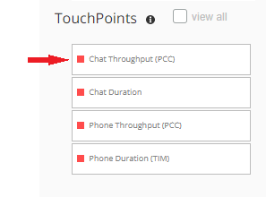

On this example the Touchpoint name is "Chat Throughput (PCC), and the PCC means that this is the type of Touchpoint designed to count processes. 

* Status "On" or "Off": This option allows you to enable or disable a touchpoint for display mode. To access this view, right click on the particular touchpoint you want to work with and click on the option "ON/OFF". 

To turn Off a Touchpoint, right click on its name, then click on the On button. To turn it back ON again, right click on the Touchpoint again and click on the OFF button.

* Dashboard_url: Corresponds to the link that directs to the Touchpoint dashboard. ASK HOW TO GET THIS LINK

* Related_steps: Indicates the step to which a Touchpoint is associated with a Touchpoint. 

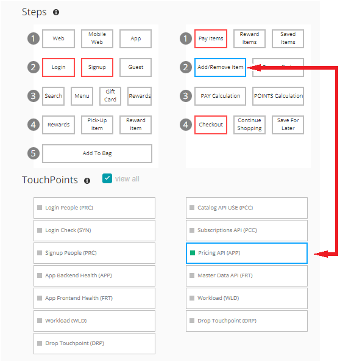

For the example, the "Agents (PRC)" Touchpoint is linked to the "Call Pop" Step.

* Queries: Allow you to determine all the parameters that of a particular Touchpoint should consider. 

 

To access this view, you just have to right click on the particular Touchpoint you want to work with and then click on  "Queries"  

     1 Type: Identify the right type of query. For this example, it is a PRC person count. (please review section "Different Touchpoint Types Explained")
     2 AccountID: Determines the account with which the query is identified.
     3 Query: Displays the actual query that determines the Touchpoint.
     4 Query_timeout: Determines the maximum time of activity in which the query will be executed.
     5 Min_count: The query will present a minimum of X number of records.
     6 Measure_time: Determines the time from when I want the query to collect information to perform the measurement.

And these are two examples of Touchpoints;

Example 1

Example 2

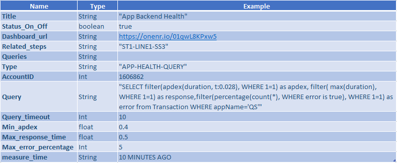

Note, there is a recomendation that when you give a Touchpoint its name, also state the type of Touchpount it is, like for example; the Touchpoint; VTEX Do API, name it like this; VTEX Do API(PCC), which tells the person looking at the Touchpoint, at a later time, that this is a PCC Touchpoint, intended to count processes.

### Pathpoint Configuration ###

Pathpoint is configured using a JSON configuration file, which is writen to the needs of your particular business. Once the configuration file is loaded, you can also manually tweek the Touchpoints (for instance to see the data that you are most concern at the moment).

### JSON Configuration File ###

JSON for its acronym (JavaScript Object Notation) is a data structure, whose basic function is to allow for the exchange of information. Through this structure it will be possible to identify each of the elements and components that will facilitate the implementation of Pathpoint, knowing the function of its attributes, queries and data output. To program new stages, path and Pathpoints, you upload a New JSON Configuration file.

Uploading a New JSON Config File

To load a JSON configuration file use the following steps;

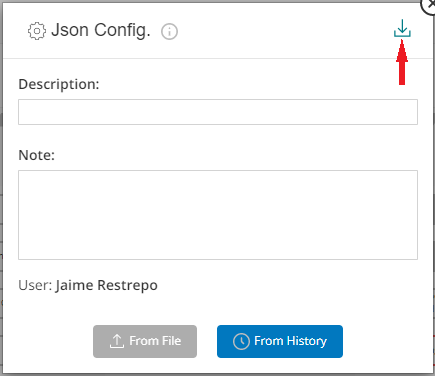

 1 To begin, once you are on the Pathpoint screen, click on the menu on the top left part of the window.

2 Now, select the option "JSON Configuration".

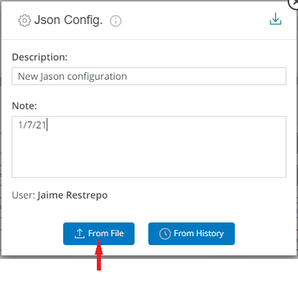

 
3 Next, select "From file"

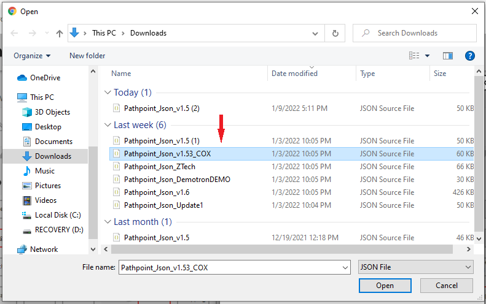

4 Next, locate the file you want to update on the dialog Box window that opens up and click on "open"

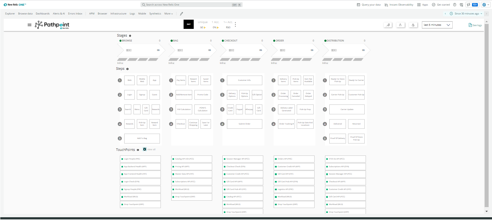

5 Finally, the Pathpoint is displayed with the updates of the particular JSON file you chose.

How to download the Currently Active Config File.

Similarly, Pathpoint offers you the possibility of downloading the current configuration file, if for instance you wish to make changes to it, which can be done using the following steps;

1 Click on the menu on the top left (once you are on the New Relic Pathpoint  window).

2 Select the option "JSON Configuration".

3 Now, select the file available to download. On this example"Pathpoint_json_vX".

4 Finally the file is downloaded to your computer, and now you can make the changes to it.

### Setting up KPI queries ##

KPI by its acronym (Key Performance Indicator), are normally known as key indicators, which allow you to see the performance of a process. 

In the case of Pathpoint, KPIs fulfill a fundamental function, which is the measurement of specific indicators within a particular process.

- Structure KPI

Where:

Type: Defines the type of measurement to be performed, which can be:
-- "100" returns the current measurement value.
-- "101" returns the current value and compares it with the value of "X" previous days

* Name: Corresponds to the long name of the KPI.

* ShortName: Corresponds to the short name of the KPI.

### Setting up Stages & Steps ###

* Measure: The data that allow the measurement to be made is displayed.

* accountID: Corresponds to the number that identifies the measurement performed.

* Query: Corresponds to the query that is used to perform the measurement.

* Link: Corresponds to the link that directs to the KPI dashboard.

* Value_type: It can be an integer value "INT" (example: 100) or a decimal value "FLOAT" (example: 100,2).

* Prefix: It is used in the case in which you want to Identify the KPI by placing a symbol or letter at the beginning of the name. Example: USD 12000

* Suffix: It is used in the case where you want to Identify the KPI by adding a symbol or letter at the end of the name. Example: 5%.

* Example KPI

* KPI Pathpoint Image

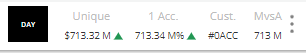

Return to top of [Index](#Index)

### Touchpoint Types ### 

As you saw before, New Relic Pathpoint offers different types of Touchpoints, which are adapted according to the needs of each business, and they are; 
* PRC (Person Count)  
* PCC (Process Count)  
* APP (Application Health)  
* FRT (Front End Health)  
* SYN (Synthetic Check)

Now, you will see some examples of each type of touchpoint;

This is an example of a PRC touchpoint;

### PRC (Person Count) ### 

● Data:

○ User Sessions

● Tunning:

○ Session Count (Min)

● Link: PRC Touchpoint Flashboards

○ Current Sessions

○ Past Sessions

○ Previous Week Comparison

Return to top of [Index](#Index)

This is an example of a PCC touchpoint;

### PCC (Process Count) ### 

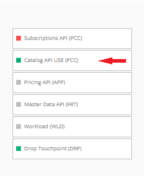

● Data:  
   ○ Transactions

● Tunning:  
   ○ Transactions Count (Min)

● Link: PCC Touchpoint Flashboard  
○ Current Transactions  
○ Past Transactions  
○ Previous Week Comparison

Return to top of [Index](#Index)

This is an example of a APP touchpoint;

### APP (Application Health) ### 

  
● Data:  
○ Transactions

● Tunning:  
○ APDEX Response (Min)  
○ % Error (Max)  
○ Response Time (Max) 

● Link: APM Transaction Dashboard  
○ APDEX  
○ Throughput  
○ Breakdown  
○ Traces

Return to top of [Index](#Index)

This is an example of a FRT touchpoint;

### FRT (Front End Health)  ### 

 
● Data:  
○ Transactions

● Tunning:  
○ APDEX Response (Min)  
○ % Error (Max)  
○ Response Time (Max)  

● Link: Page View Transaction Dashboard  
○ APDEX  
○ Throughput  
○ Breakdown  
○ Traces

Return to top of [Index](#Index)

This is an example of a SYN touchpoint;

### SYN (Synthetic Check)   ###

● Data:  
○ Synthetic Monitor Data

● Tunning:  
○ Avg Request Time (Max)  
○ Total Check Time (Max)  
○ % Success Rate (Min)  

● Link: Synthetic Monitor Results Dashboard  
○ Long Running Tasks  
○ Bytes Transferred  
○ Requests  
○ Total Time  
○ Requests Waterfall  

Return to top of [Index](#Index)

### Setting up Touchpoints ###

Return to top of [Index](#Index)
### App Touchpoint Tuning ###

This type of Touchpoint has 3 values;

* APDEX Responce (Min)  
* Response time (Max)  
* % Error (Max)

Return to top of [Index](#Index)
### Test a Touchpoint ###

This is a function that allows you to test the vaility or health of a particular Touchpoint.

To beging the process of testing a Touchpoint, right click on it, and then select Queries. On this example I clicked on the Customer credit API (which is a PCC type of Touchpoint), to test this particular Touchpoint..

Now, on the Dialog box window that opens up, click on "Test", to test the Touchpoint, now notice on the right the result of the test, on this example, it says; "Succesfully validated", meaning the Touchpoint is correct.

But lets say that you change some part of the given query, for instance to test another aspect of the Touchpoint, now you must test the Touchpoint again.

Notice how on this example I changed the Query, in front of count(*), I added three 000, and then I clicked on "Test", to test the Touchpoint. Now, you can see the result, on the right; "incorrect validation". So now the query, that was rigth before, is incorrect now. 

If you chose to change the given Query, test your changes by clicking on "Test", to make sure the Touchpoint is "healthy", if it is, then save them (click on "Save/Update"). If is not find out why, and fix it. Now, if the validation fails, find out why, and fix it, then test it again until you get the "Successfully validated" message.

QUERY'S

SYNTHETIC MONITOR QUERY

SELECT filter(percentage(count(result),WHERE result='SUCCESS'),WHERE 1=1) as success, max(duration) as duration, max(longRunningTasksAvgTime) as request from SyntheticCheck,SyntheticRequest WHERE monitorName='BDB Live person'

Has 3 variables;

* SUCCESS (percentage)
* DURATION (time)
* REQUEST (time)

PCC QUERY

SELECT count(*) from Transaction WHERE appName='QS' AND name='WebTransaction/Action/login'

Wait for a value on a variable called "Count"

PRC QUERY

SELECT count(*) as session FROM Public_APICall WHERE awsRegion='us-east-1'

MASTER DATA API QUERY  (FRT)

SELECT filter(apdex(duration, t:1), WHERE 1=1) as apdex, filter( max(duration), WHERE 1=1) as response,filter(percentage(count(*), WHERE error is true), WHERE 1=1) as error from PageView WHERE appName='QS'

Workload (WLD)

SELECT latest(statusValue) as statusValue FROM WorkloadStatus WHERE entity.name='Demotron V2 - Acme Dev'

The only thing that can be changed on this query, is the entity name.

Subscriptions API (SYNC)

SELECT filter(percentage(count(result),WHERE result='SUCCESS'),WHERE 1=1) as success, max(duration) as duration, max(longRunningTasksAvgTime) as request from SyntheticCheck,SyntheticRequest WHERE monitorName='BDB Live person'

App Backend Health (APP)

SELECT filter(apdex(duration, t:0.028), WHERE 1=1) as apdex, filter( max(duration), WHERE 1=1) as response,filter(percentage(count(*), WHERE error is true), WHERE 1=1) as error from Transaction WHERE appName='QS'

Has 3 variables;

* APDEX

* RESPONSE, which measures the duration of a process

* Error

Return to top of [Index](#Index)
### Tune Touchpoint Thresholds ###

* LOGIN PEOPLE PRC

These valued are defined on the JSON file, and you can also change them, manually by right clicking on the Touchpoint, and selecting Query.

There are two important values on this Touchpoint;

* Session count (Min), if the value (under "Configured"), is  for example set at 10, and the value of sessions, on the last 5 minutes, is below this number, the status of the Touchpoint will turn red.
* Session count (Max), if the value (under "Configured"), is  for example set at 110, and the value of sessions, on the last 5 minutes, is above this number, the status of the Touchpoint will turn red. You will see the color of the Stage label turn, from blue, to white.

Subscriptions API (PCC)

These valued are defined on the JSON file, and you can also change them, manually by right clicking on the Touchpoint, and selecting Query.

There are two important values on this Touchpoint;

* Transactions count (Min), if the value (under "Configured"), is  for example set at 36, and the value of sessions, on the last 5 minutes, is below this number, the status of the Touchpoint will turn red.
* Transactions count (Max), if the value (under "Configured"), is  for example set at 136, and the value of sessions, on the last 5 minutes, is above this number, the status of the Touchpoint will turn red. You will see the color of the Stage label turn, from blue, to white.

Login Check (SYN)

There are three important values on this Touchpoint;

* Avg response time (MAX), if the value (under "Configured"), is  for example set at .07, and the value of sessions, on the last 5 minutes, is higher than this number, the status of the Touchpoint will turn red.
* Total Check Time (Max), if the value (under "Configured"), is  for example set at 1.25, and this value on the last 5 minutes, is above this number, the status of the Touchpoint will turn red.  
* %Success Rate (Min), if the value (under "Configured"), is  for example set at 98, and this value on the last 5 minutes, is below this number, the status of the Touchpoint will turn red.  

Return to top of [Index](#Index)
### Disable a Touchpoint ###

You can manually work with a particular Touchpoint, by disabling it, and later on you can also turn it back on.

To disable a Touchpoint, right click on it. On this example I clicked on the Customer credit API (which is a PCC type of Touchpoint).

 

Now, on the pop-up box window, click on the "On" symbol, to disable the Touchpoint. Later on you can right click on the same Touchpoint, then on the "Off" symbol, to enable it again.

Return to top of [Index](#Index)
### Configure Logging###

Ask Jim Hagan about this

Return to top of [Index](#Index)
### Configure Background Jobs ###

Return to top of [Index](#Index)
### Flame Filter Script ###

Return to top of [Index](#Index)
### Drop Filter Script ###

Drop Touchpoint (DRP)

SELECT latest(statusValue) as statusValue FROM WorkloadStatus WHERE entity.name='ACME Banking'

Return to top of [Index](#Index)
### Using Special Filters ###

Return to top of [Index](#Index)
### Canary Filter ###

The Canary filter, when activated, reset all the the different Steps, so that you can manually activate the Steps, which will help you troubleshoot a particular process.

On this Pathpoint, you can see all the different Steps that are active right now, to troubleshoot this Pathpoint, you can turn off all of the Steps, and then enable them one by one, after turning on the Canary filter.

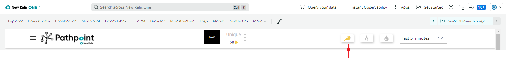

To activate it, just click on the Canary Symbol (on the top right part of the Pathpoint window), which now changes its color, to yellowish. On the Pop Up window that opens up, click on "Continue" to activate this filter.

Now, you can see that the steps that were previously active, don't show any activity. 

Now, you can click on any of the Steps you want to troubleshoot, to enable them, for instance "Web" and "Login", and also notice, that this action also enables the corresponding Touchpoints.

Please note that when you are running the Pathpoint background job, the signals for non-visible touchpoints will still be available when you are using the Flame view.

Return to top of [Index](#Index)
### Flame Filter ###

The Flame filter will highlight the most problematic “Steps and Touchpoints” with a configurable time window and percentile threshold. When you use this filter, you will see the worst Touchpoints (the status of the Touchpoint will turn red), as well the ones that are not behaving well (the status of the Touchpoint will turn green), like for instance the ones that are not meeting the threshold as the percentage is concern. 

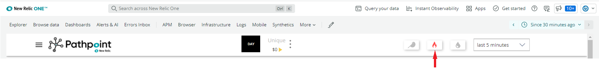

To activate it, just click on the Flame Symbol, which now changes its color, to a reddish flame. On the Pop Up window that opens up, click on "Continue" to activate this filter.

This is very useful in situations where things look okay now but may have had a pattern of errors or latency in the recent past. To use this filter, you will need to install a background script that is downloadable from the Pathpoint Setup Menu.

Return to top of [Index](#Index)

### Drop Filter ###

Function: 

 Highlights Steps with Most Drops (Session Breaks or Abandonment) 

 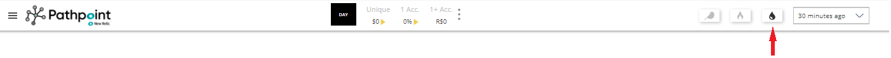

 To activate it, just click on the tear-drop Symbol, which now changes its color, to black. 

Displays a Total Drop count per Stage

 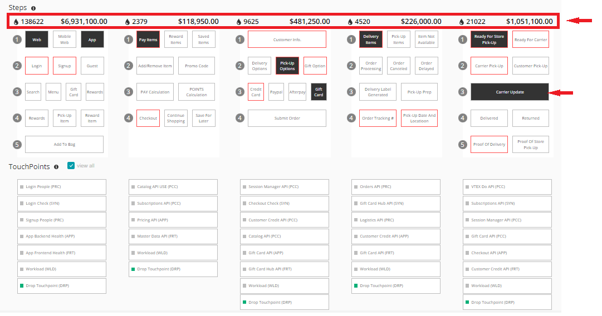

Calculates the order or transaction loss by the drops

Tunning: 
Avg Order or Transaction Value
Incident %
Time Period

Return to top of [Index](#Index)

